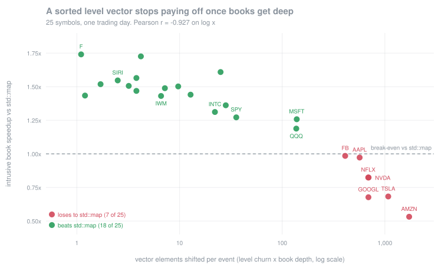

# hotpath

A deterministic, allocation-free tick-to-trade engine for NASDAQ TotalView-ITCH
5.0, built to answer two questions with measurements rather than assertions:
**which order book design actually wins on real market data, and how wrong is
the fill model most backtests use?**

Everything below is from one full trading day — 2019-12-30, 8.25 GB,
**268,744,780 messages** — and is regenerated by `./scripts/regenerate.sh`.

## Results

**A signal that predicts price does not make a passive strategy better — and
the near-miss is the interesting part.** Queue imbalance forecasts the 1s mid
move on all 25 symbols (correlation up to 0.22, monotone decile response), but
gating quotes on it improves markout on only 9 of 25 (sign test p = 0.230).
On AAPL alone it looked like a **+0.101 bps edge, significant at p < 0.05** —
and it did not replicate. The reason it fails is quantitative: the signal's
entire top-to-bottom decile range is 0.07x–0.98x of *one half-spread*, while
acting on it forfeits queue position. The forecast is real; it just isn't worth
a half-spread. [Details](docs/SIGNALS.md)

**The naive fill model overstates passive volume by 3.4x to 15.6x** (median
5.7x, measured on 25 symbols). Simulating a market maker joining the touch, a
model that fills whenever the price trades books 3.5M shares on AAPL; a model
that tracks FIFO queue position — and advances it when orders ahead are
*cancelled*, not just executed — books 549K. The error is worst exactly where
you fill least: 3.7x on SPY, 15.6x on SIRI.
[Details](docs/ADVERSE-SELECTION.md)

**Passive fills are adversely selected — 25 of 25 symbols, sign test p = 6×10⁻⁸.**
Every markout is share-weighted with a 95% block-bootstrap interval, because
fills arrive in bursts and resampling them independently would give intervals
several times too tight. The intervals also *cost* a claim: an earlier version
of this repo said markout worsens with queue depth on 10 of 13 symbols. Tested
properly, 8 of 25 significantly support that and **3 significantly reverse it**
— real symbol-specific structure, but not the one-directional law the point
estimates suggested. SPY shows an order of magnitude less adverse selection than
the single names, as expected for a broad index ETF — and at the 10s horizon its
interval spans zero, which the point estimate alone would have hidden.



**The "textbook HFT" order book loses to `std::map` on 7 of 25 symbols.** The
pooled, zero-allocation, intrusive book is beaten by up to 1.9x (AMZN), because
its sorted level vector shifts hundreds to thousands of elements per event on
deep books. The predictor is `level churn × depth` with **Pearson r = −0.927**,
and the crossover is sharp — MSFT still wins at 139 elements shifted per event,
FB already loses at 411. It looks like a price effect until the ETFs break it:
SPY at $321 wins with 699 levels while AAPL at $250 loses with 4,652. The design
the measurements imply — direct-addressed grid plus per-level intrusive FIFO —
beats `std::map` on all 25 (median 2.62x) and the intrusive book on all 25 (up
to 7.3x). [Details](docs/PERFORMANCE.md)


**Latency doesn't cost you fills — it changes which fills you get.** Sweeping
re-quote latency from 0 to 10 ms degrades 10s markout monotonically on every
symbol (57% worse on AAPL, 6.5x on SPY), but the AAPL fill *count* is U-shaped
and ends 15% **higher** than at zero latency, with half of all filled volume
landing on stale quotes. A slow maker doesn't trade less; it loses the queue
races it wanted and gets filled on the quotes it was trying to cancel. And
microseconds matter because executions arrive in bursts — the median gap before
an execution is 26 µs on AAPL and 6.3 µs on SPY, against ~105 µs between events
generally. [Details](docs/ADVERSE-SELECTION.md#result-4--what-re-quote-latency-actually-costs)

**Pipelining the tick-to-trade path across lock-free rings makes it slower.**
Splitting feed / book+strategy / gateway across three threads costs a
near-constant +13 to +18 ns/event on every symbol — the ring hop itself — for a
1.30x to 1.62x slowdown. That model then made a prediction and passed it: after
a later optimisation made the strategy stage ~2.5x cheaper, the absolute penalty
stayed put and every ratio got *worse*. Ring occupancy says why without guesswork: the first
ring is ≥75% full 99.2% of the time and the second is empty 95.3% of it, so the
stages are wildly unbalanced. The fill streams hash identically to the
single-threaded path, so the handoff is correct; it just does not pay here.
[Details](docs/PERFORMANCE.md#threaded-tick-to-trade-pipeline)

**`memory_order_relaxed` in the SPSC ring reproducibly breaks on arm64** — 1,463
premature reads and 544 torn reads per 10.5M messages, against zero for
release/acquire. The same code passes on x86 because TSO forbids the reordering,
which is what makes this class of bug so dangerous.
[Details](docs/PERFORMANCE.md#spsc-ring-memory-ordering-and-false-sharing)

## Correctness

| gate | result |
|---|---|
| Four independent book designs, ten-deep snapshot compared after **every** event | **0 divergences** over 18,798,869 events across 25 symbols |
| All four drain to zero resting orders at the close | yes |
| Full-day parse: framing, spec lengths, referential integrity | **0** orphaned references over 268.7M messages |
| Every order live at peak (1,924,078) accounted for by the close | yes |
| Threaded pipeline reproduces the single-threaded fill stream | identical digests, all 4 symbols |
| Replay determinism: 20 runs at `-O3` + 1 at `-O0` | identical digests, all 4 tapes |
| Heap allocations in steady state | **0** on the dense path; every allocation reconciles 1:1 against a `std::map` overflow level |
| Syscalls in steady state | **0** (enforced by dyld `__interpose`) |
| ThreadSanitizer / ASan+UBSan | clean |
| Fuzzing: ITCH parser + four-way book differential, under ASan | 150,000 iterations / 154 MB, 0 failures |

The cross-validation is not ceremony: it caught the intrusive book *silently
dropping orders* when its level pool filled, which left the book permanently
wrong with no signal.

## A note on latency numbers

**This repo publishes no tick-to-trade percentile, on purpose.** It was built on
an Apple M5 Pro, where the userspace clock ticks at 41.667 ns and 79% of
back-to-back `mach_absolute_time()` calls return a delta of *zero*. Timing a
300 ns path with a 42 ns ruler produces the quantiser's distribution, not the
code's. macOS also has no `perf`, no `isolcpus`, and ignores thread affinity on
Apple Silicon.

So the claims here are ones this hardware can actually support: exact counts,
amortised costs over 10^6+ events, ratios between designs on byte-identical
input, and invariants that need no clock at all. What is *not* claimed, and why,
is written down in [docs/METHODOLOGY.md](docs/METHODOLOGY.md).

Porting to bare-metal x86 Linux would make real p99/p99.9 distributions
available; only the cache-line constant and clock source would change.

## Build

```bash
brew install cmake ninja
cmake -S . -B build -G Ninja -DCMAKE_BUILD_TYPE=Release
cmake --build build
./build/tests/hotpath_tests

./scripts/fetch_data.sh 12302019      # ~3.5 GB gz -> 8.25 GB raw, resumable
./scripts/regenerate.sh               # every number in docs/
```

Market data lives outside the repo (`$HOTPATH_DATA_DIR`, default
`~/market-data/itch`) so a multi-GB file can never be committed by accident.

## Layout

```
include/hotpath/
  core/    types, cache-line constants, timebase, open-addressing hash map
  itch/    zero-copy ITCH 5.0 views over an mmap, BinaryFILE framing
  book/    four order book designs behind one duck-typed interface
  ipc/     SPSC ring with ordering and padding as policy parameters
  sim/     FIFO queue position, fill model, market maker, microstructure signals
src/       itch_stat, extract_tape, tape_stat, book_crossval, sim_mm,
           latency_sweep, signal_study, strategy_eval, pipeline, litmus_ring
bench/     book design study, false-sharing experiment
docs/      METHODOLOGY, PERFORMANCE, ADVERSE-SELECTION, BUILDLOG
```

## Known gaps

No network stack, kernel bypass, or NIC timestamping — the pipeline is
in-process (threads and shared memory, not sockets). The fill model has no self-impact and no latency on re-quotes, so
its fill counts remain an upper bound. One trading day, four symbols.

## Related

[`simplified_gto_solver`](https://github.com/ewang1027/simplified_gto_solver) —
the theory counterpart: adverse selection *solved for* in Kyle and
Glosten–Milgrom games. This repo *measures* the same quantity from real order
flow.
