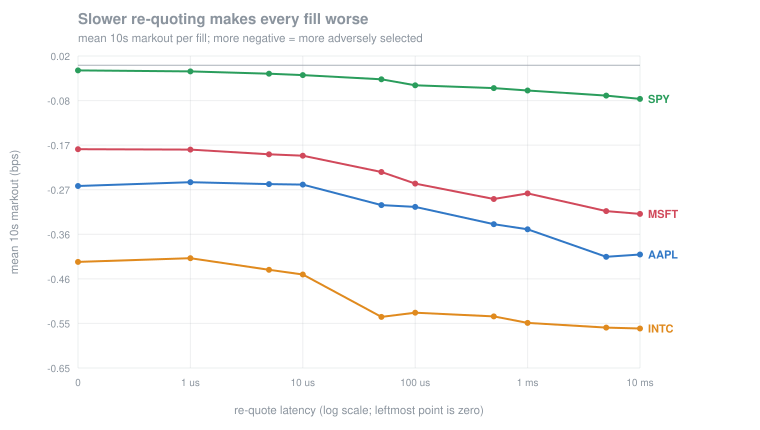

# Queue position, fills, and adverse selection

One NASDAQ ITCH 5.0 trading day (2019-12-30). A passive market maker joins the
touch on both sides with a 100-share quote and re-quotes whenever the touch
moves. Reproduce with `./build/src/sim_mm <SYM>.tape --size 100`.

## Why the fill model is the whole point

The simulated strategy here is deliberately trivial — join the touch, re-quote
when it moves. Nothing about it is clever, and it is not supposed to be. The
question this answers is not "is this a good strategy" but **"how wrong is the
fill model that most backtests use?"**

Two models run side by side on identical order flow:

- **naive** — you fill whenever the price trades, up to your quoted size. This is
  what a backtest does implicitly when it has quotes and trade prints and no
  order-by-order book.
- **queue-aware** — you fill only once cumulative executed volume at your price
  exceeds the volume resting *ahead* of you, and your position in the queue also
  advances when orders ahead of you are **cancelled**.

That second clause matters more than it sounds. On this day, adds and deletes
are 85% of all messages and executions are 1.7%: **most of the queue in front of
you disappears by being cancelled, not by trading.** A model that only advances
the queue on executions concludes you never get to the front. A model that fills
whenever the price trades concludes you are always at the front. Both are wrong,
in opposite directions.

## Result 1 — the naive model overstates fills by 3.7x to 6.4x

| symbol | naive fills | naive shares | queue-aware fills | queue-aware shares | overstatement |
|---|---:|---:|---:|---:|---:|
| AAPL | 60,543 | 3,523,775 | 9,535 | 548,567 | **6.4x** |
| SPY | 42,635 | 3,114,511 | 12,058 | 840,427 | **3.7x** |
| MSFT | 35,315 | 2,231,187 | 9,403 | 597,638 | **3.7x** |
| INTC | 19,405 | 1,376,264 | 4,434 | 290,994 | **4.7x** |

A backtest using the naive model books between 3.7 and 6.4 times the passive
volume it would actually get. Every per-share edge it computes is being applied
to a fill count that does not exist.

## Result 2 — passive fills are adversely selected

Markout is the mid-price move after the fill, signed so that positive means the
fill was good: `sign × (mid(t+h) − fill_price)`, with `sign = +1` for buys.
Means are **share-weighted** — a 1-share fill and a 500-share fill are not equal
evidence — with a 95% **block bootstrap** confidence interval over 5-minute
blocks, 2000 resamples. Blocks rather than individual fills because fills
cluster hard: executions arrive in microsecond bursts against a ~100 ms median
event gap, so resampling fills independently would treat a burst of correlated
fills as independent evidence and return an interval several times too tight.

Queue-aware model, markout in basis points with 95% CI:

| symbol | 1s | 10s | 60s |
|---|---|---|---|
| AAPL | −0.219 [−0.260, −0.178] | −0.259 [−0.323, −0.198] | −0.262 [−0.417, −0.111] |
| MSFT | −0.116 [−0.143, −0.081] | −0.180 [−0.252, −0.113] | −0.204 [−0.322, −0.091] |
| INTC | −0.373 [−0.420, −0.326] | −0.422 [−0.534, −0.315] | −0.443 [−0.569, −0.321] |
| SPY | −0.024 [−0.035, −0.012] | −0.011 [−0.043, **+0.022**] | +0.082 [−0.020, +0.181] |

**The 10s markout is negative on 25 of 25 symbols (sign test p = 6×10⁻⁸).**
After you are filled, the mid keeps moving against you. That is adverse
selection — the counterparty who traded with you knew something, or at minimum
your fill was caused by the price moving through your level.

SPY is the informative exception, and the interval sharpens what can be said
about it. Its adverse selection is an order of magnitude smaller than AAPL's,
and at the 10 s horizon **the interval spans zero** — on one session, SPY's
adverse selection is only resolvable at 1 s. That is what you would expect from
a broad-index ETF: order flow in it carries far less single-name private
information. Reporting the point estimate alone (−0.011) would have implied a
precision the data does not support.

## Result 3 — queue depth matters, but not in one direction

10-second markout on the queue-aware model, bucketed by how much volume was
resting ahead when we joined. AAPL, with intervals:

| volume ahead at join | fills | markout | 95% CI |
|---|---:|---:|---|
| 1–100 | 6,274 | −0.196 | [−0.267, −0.126] |
| 101–500 | 2,803 | −0.358 | [−0.480, −0.248] |
| 501–2000 | 394 | −0.645 | [−1.031, −0.273] |
| >2000 | 64 | +0.240 | [−1.057, +1.214] |

The staircase is real on AAPL, and the deep-minus-shallow difference is
**−0.449 [−0.834, −0.070]** — significant. (The `>2000` bucket has 64 fills and
an interval two bps wide; the earlier version of this table reported its
point estimate of +0.111 as if it meant something.)

**Across 25 symbols the picture is more complicated, and an earlier version of
this document overstated it.** Testing deep-minus-shallow per symbol with a
paired block bootstrap:

| | count |
|---|---|
| significant | **11 / 25** (≈1.25 expected by chance at 5%) |
| …supporting (deep worse) | 8 — AAPL, IWM, KO, MSFT, NVDA, SPY, WFC, XOM |
| …opposing (deep better) | 3 — GE, JPM, T |
| point estimate negative | 14 / 24, sign test **p = 0.541** |

So there is real symbol-specific structure — eleven significant results where
chance would give about one is not an accident — but **it is not consistently
signed**. Three symbols significantly reverse it, and the sign test across
point estimates is a coin flip.

The mechanism argues for the negative direction: to be filled from deep in a
queue, the market must trade *through* everything resting in front of you, which
only happens when the price is being pushed through your level — precisely when
you did not want the fill. That story holds on 8 symbols. It does not hold
universally, and the honest statement is that queue depth changes *which* fills
you get in a symbol-specific way, not that deeper is uniformly worse.

The earlier claim here was "worsens with queue depth on 10 of 13 symbols",
counted by comparing bucket point estimates. That was a directional tally
dressed up as a finding: buckets have wildly different sample sizes, and
comparing their means is not a test. Adding one downgraded it.

## Relation to the theory

This is the empirical counterpart to the Glosten–Milgrom work in
[`simplified_gto_solver`](https://github.com/ewang1027/simplified_gto_solver),
where adverse selection is *solved for* in a game where a maker quotes against
possibly-informed flow. Here it is *measured*, from one day of real order flow,
with no model of the informed trader at all — and it shows up as a negative
markout that scales with how much the counterparty had to trade through to reach
you.

## Replication across 25 symbols

Results 1–3 were first measured on four symbols. Four points can describe almost
any curve, so the study was widened to 25 spanning $7 (SIRI) to $1,784 (AMZN)
and 70K to 2.4M events — 18,798,869 events in total, all four book designs
cross-validating with **zero divergences** on every one.

| finding | replication |
|---|---|
| Naive model overstates filled volume | **25 / 25**, from 3.4x to **15.6x**, median 5.7x |
| Passive fills are adversely selected (negative 10s markout) | **25 / 25** |
| Markout worsens with queue depth | **8 / 25** significantly support, **3 / 25** significantly oppose (see Result 3) |

**The overstatement is worse than the four-symbol sample suggested.** The
original range was 3.7–6.4x; across 25 it reaches **15.6x on SIRI** and 12.9x on
AMZN. The pattern is systematic: the overstatement is largest exactly where you
fill least. SPY (12,058 fills) and MSFT (9,403) sit at 3.7x, while SIRI (82
fills) and GE (291) are at 15.6x and 12.8x. Where a passive order genuinely
reaches the front of the queue, the two models converge; where it rarely does,
assuming it always fills is catastrophically wrong.

**The queue-depth result survived a proper test only in part.** With a paired
block bootstrap per symbol, 11 of 25 are significant — far more than the ~1.25
chance would give, so the structure is real — but 8 support the effect and 3
significantly reverse it, and the sign test on point estimates is p = 0.541.
See Result 3.

## Result 4 — what re-quote latency actually costs

Everything above assumes re-quotes are instantaneous. They are not, and the
delay between seeing the touch move and having your quote in the right place is
the single number every nanosecond of tick-to-trade engineering exists to
reduce. `latency_sweep` measures what it buys.

Two mechanisms pull in opposite directions:

1. **You join later**, so more participants are ahead of you. Fewer fills.
2. **Your old quote is still resting at a stale price** while the replacement is
   in flight. When the market moves away, that stale quote is now the most
   aggressive one in the book and gets run over. *More* fills — and precisely
   the ones you did not want.

Mean 10s markout in bps, by re-quote latency:

| latency | AAPL | SPY | MSFT | INTC |
|---|---:|---:|---:|---:|
| 0 | −0.259 | −0.011 | −0.180 | −0.422 |
| 1 µs | −0.251 | −0.013 | −0.181 | −0.414 |
| 10 µs | −0.256 | −0.021 | −0.194 | −0.449 |
| 50 µs | −0.300 | −0.030 | −0.229 | −0.540 |
| 100 µs | −0.304 | −0.043 | −0.254 | −0.531 |
| 1 ms | −0.352 | −0.054 | −0.275 | −0.553 |
| 10 ms | **−0.406** | **−0.072** | **−0.319** | **−0.565** |

**Fill quality degrades monotonically with latency on every symbol** — 57% worse
on AAPL, 77% on MSFT, and 6.5x on SPY, which starts closest to break-even and
therefore has the most to lose in relative terms.

### The counterintuitive part: latency does not simply cost you fills

| | AAPL fills | stale share of volume | swept fills |
|---|---:|---:|---:|
| 0 | 9,535 | 0.0% | 0 |
| 1 µs | 10,518 | 10.2% | 989 |
| 100 µs | 9,456 | 16.5% | 1,255 |
| 10 ms | **11,014** | **50.0%** | 4,501 |

On AAPL the fill count is *U-shaped*: it rises at microsecond latency, dips in
the middle, and rises again past a millisecond — ending 15% **above** the
zero-latency count. By 10 ms, **half of all filled volume is on stale quotes**.

So the naive intuition ("slow means you miss fills") is wrong on the most active
symbol. Latency does not reduce how much you trade so much as it changes *what*
you trade: you lose the queue races you wanted to win and get filled on the
quotes you were trying to cancel. SPY, MSFT and INTC do show declining fill
counts, but their markouts degrade all the same — the mix shifts even when the
volume falls.

### Why microseconds register at all

The median gap between events on AAPL is 105 µs, which makes a 1 µs delay look
irrelevant. It is not, because **executions arrive in bursts far tighter than
the average**:

| symbol | median inter-event gap | median gap preceding an *execution* | gaps < 1 µs |
|---|---:|---:|---:|
| AAPL | 105 µs | **26 µs** | 5.0% |
| SPY | 108 µs | **6.3 µs** | 4.1% |

Fills happen during bursts, and during bursts the market moves in microseconds.
Latency bites exactly when it matters. Regenerate with
`./build/src/tape_stat <SYM>.tape`.

### A caveat on the dollar figures

`latency_sweep` also prints a P&L proxy (markout × filled shares). Read the
markout column, not that one. This strategy has *negative* edge at every latency
— it quotes at the touch unconditionally, with no inventory management, no
skew, and no toxicity filter — so "trade less" mechanically improves P&L. On
INTC, higher latency therefore looks *better* on the dollar axis while fill
quality is plainly getting worse. Per-share markout is the honest metric for a
strategy that should not be trading in the first place.

## The model's central assumption, measured

The queue model advances on volume consumed at a price level, which is only
sound if the exchange consumes that level in strict time priority. That
assumption is checkable, so it is checked rather than believed.

Walking each level's FIFO and asking whether the executed order was actually at
its head:

| symbol | executions | not at the FIFO head |
|---|---:|---:|
| AAPL | 60,543 | 759 (1.25%) |
| SPY | 42,635 | 1,346 (3.16%) |
| MSFT | 35,315 | 1,589 (4.50%) |
| INTC | 19,405 | 521 (2.68%) |
| AMZN | 15,123 | 402 (2.66%) |

So strict FIFO does **not** hold on the displayed book — unsurprising, since
ITCH shows displayed liquidity and the matching engine ranks on more than that.

The case that actually threatens the model is narrower: an order that arrived
*after* we joined trading while volume we believe is ahead of us still rests.
`sim_mm` reports it (`strict-FIFO violations observed`), and it is rare — 73 on
AAPL against 9,535 fills, 855 on SPY, 0 on AMZN.

One tempting "fix" is wrong and worth recording. Requiring the executed order to
be ahead of us before advancing the queue sounds principled; it drops the fill
count to **exactly zero** on every symbol. We join at the back, so once
everything ahead has been consumed the only orders still resting arrived after
we did — the execution that legitimately reaches us is *always* one of those.
What governs is the volume consumed at the level, not which order consumed it.

## Honest limitations

- **No self-impact.** Our order is hypothetical and never enters the book, so it
  never deters or attracts anyone else's order. A real 100-share quote at the
  touch would change the flow it is measuring.
- **The strategy is deliberately trivial.** Join the touch, re-quote when it
  moves. It is a measurement instrument for the fill model, not a proposal.
- **Latency is modelled as a fixed delay**, symmetric for cancels and new
  orders, with no queueing or jitter.
- **Strict FIFO is assumed and is not exactly true** (see above): 1.3–4.5% of
  executions are not at the level's FIFO head, and the model absorbs those.
- **Queue-position-only fill priority.** Hidden orders, odd-lot handling, and
  non-displayed liquidity are not modelled; ITCH does not show them.
- **One trading day.** The cross-section is 25 symbols wide; the time series is
  n=1. A sign test across 25 correlated symbols on the same session is not 25
  independent trials, and the confidence intervals quantify sampling variation
  *within* that session only — they say nothing about day-to-day variation.
